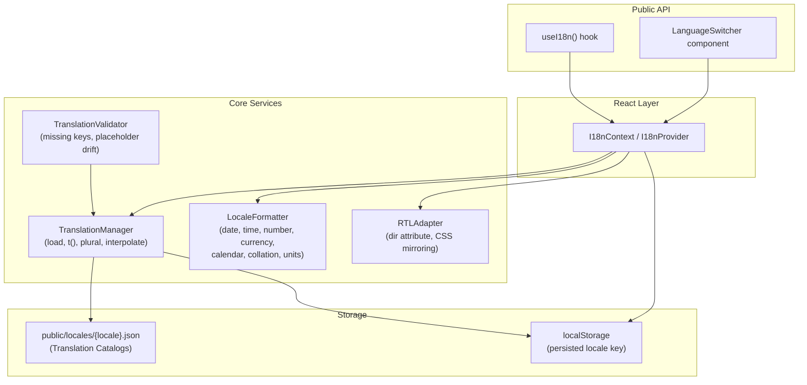

# Design Document: i18n-localization

## Overview

This design adds a comprehensive internationalization (i18n) and localization (l10n) subsystem to the Fidelis Soroban DApp. The system is built natively in TypeScript/React without a third-party i18n framework, keeping the bundle lean and giving full control over catalog structure, plural rules, and RTL behavior.

The subsystem is composed of four primary services — `TranslationManager`, `LocaleFormatter`, `RTLAdapter`, and `TranslationValidator` — wired together through a React context (`I18nContext`) and exposed to components via a `useI18n` hook. Translation catalogs are JSON files loaded at runtime; locale preference is persisted to `localStorage` following the same pattern used by `ThemeContext`.

The design deliberately mirrors the existing context/service architecture already present in the codebase (e.g., `ThemeProvider`, `ConnectivityProvider`) so that integration is consistent and familiar.

---

## Architecture



### Key Design Decisions

- **No external i18n library**: The `Intl` browser API covers formatting (dates, numbers, currencies, collation, plural rules) natively. A thin wrapper is all that is needed.
- **Lazy catalog loading**: Catalogs are fetched on demand via `fetch('/locales/{locale}.json')` and cached in memory, avoiding upfront bundle cost.
- **Fallback chain**: active locale → fallback locale (`en-US`) → raw key. This matches Requirement 1.3–1.4.
- **RTL via `dir` attribute + CSS logical properties**: Setting `document.documentElement.dir` triggers browser-native RTL reflow. Components use CSS logical properties (`padding-inline-start`, `margin-inline-end`, `flex-direction`) so no per-component RTL overrides are needed.
- **Vitest + fast-check for property tests**: The project already uses Vitest; `fast-check` is added as a dev dependency for property-based testing.

---

## Components and Interfaces

### TranslationManager

```typescript
interface TranslationManager {
  /** Load a catalog for the given locale (fetches JSON, caches in memory) */
  loadCatalog(locale: string): Promise<void>;

  /** Retrieve a translated string with optional interpolation */
  t(key: string, values?: Record<string, string | number>): string;

  /** Retrieve a pluralized string based on count */
  plural(key: string, count: number, values?: Record<string, string | number>): string;

  /** Parse a raw JSON string into a TranslationCatalog */
  parseCatalog(json: string): TranslationCatalog;

  /** Serialize a TranslationCatalog to a JSON string */
  serializeCatalog(catalog: TranslationCatalog): string;

  /** Emit a warning event for a missing key */
  onMissingKey(handler: (key: string, locale: string) => void): void;

  readonly activeLocale: string;
  readonly fallbackLocale: string;
  readonly loadedLocales: string[];
}
```

### LocaleFormatter

```typescript
interface LocaleFormatter {
  formatDate(value: Date, locale: string, options?: Intl.DateTimeFormatOptions): string;
  formatTime(value: Date, locale: string, options?: Intl.DateTimeFormatOptions): string;
  formatNumber(value: number, locale: string, options?: Intl.NumberFormatOptions): string;
  formatCurrency(value: number, locale: string, currency: string): string;
  formatMeasurement(value: number, unit: string, locale: string): string;
  sort(strings: string[], locale: string): string[];
  getFirstDayOfWeek(locale: string): 0 | 1 | 6; // 0=Sun, 1=Mon, 6=Sat
  getCalendarSystem(locale: string): string;     // 'gregory' | 'islamic' | 'hebrew' | ...
  getNameOrder(locale: string): 'given-first' | 'family-first';
}
```

### RTLAdapter

```typescript
interface RTLAdapter {
  /** Returns true if the locale is RTL */
  isRTL(locale: string): boolean;

  /** Apply or remove RTL mode on the document root */
  apply(locale: string): void;
}

// RTL locales (minimum set per Requirement 4.6)
const RTL_LOCALES = new Set(['ar', 'he', 'fa']);
```

### TranslationValidator

```typescript
interface ValidationViolation {
  type: 'missing_in_locale' | 'extra_in_locale' | 'placeholder_mismatch';
  locale: string;
  key: string;
  detail?: string;
}

interface ValidationReport {
  violations: ValidationViolation[];
  violationCount: number;
  isClean: boolean;
}

interface TranslationValidator {
  validate(catalogs: Record<string, TranslationCatalog>, fallbackLocale: string): ValidationReport;
}
```

### I18nContext / useI18n

```typescript
interface I18nContextValue {
  locale: string;
  availableLocales: string[];
  setLocale: (locale: string) => Promise<void>;
  t: TranslationManager['t'];
  plural: TranslationManager['plural'];
  formatter: LocaleFormatter;
  isRTL: boolean;
}

// Hook
function useI18n(): I18nContextValue;
```

### LanguageSwitcher Component

A `<select>` element rendering one `<option>` per available locale. Calls `setLocale` on change. Accessible via `aria-label`.

---

## Data Models

### TranslationCatalog

```typescript
/**
 * In-memory representation of a locale's translation catalog.
 * Keys are dot-separated strings (e.g. "nav.balances").
 * Values are either a plain string or a plural object.
 */
type PluralVariants = {
  zero?: string;
  one: string;
  two?: string;
  few?: string;
  many?: string;
  other: string;
};

type TranslationValue = string | PluralVariants;

interface TranslationCatalog {
  locale: string;
  version: string;
  translations: Record<string, TranslationValue>;
}
```

### JSON File Format

Catalogs live at `public/locales/{locale}.json`:

```json
{
  "locale": "en-US",
  "version": "1.0.0",
  "translations": {
    "nav.balances": "Balances",
    "nav.pending": "Pending ({count})",
    "tx.count": {
      "one": "{{count}} transaction",
      "other": "{{count}} transactions"
    }
  }
}
```

Interpolation uses `{{placeholder}}` syntax. Plural keys follow CLDR plural category names (`zero`, `one`, `two`, `few`, `many`, `other`).

### Persisted Locale Key

```
localStorage key: "fidelis-locale"
value: locale string, e.g. "fr-FR"
```

### Locale Initialization Priority

1. `localStorage.getItem('fidelis-locale')` — persisted preference
2. `navigator.languages[0]` / `navigator.language` — browser preference (matched against loaded catalogs)
3. `"en-US"` — fallback locale

---

## Correctness Properties

*A property is a characteristic or behavior that should hold true across all valid executions of a system — essentially, a formal statement about what the system should do. Properties serve as the bridge between human-readable specifications and machine-verifiable correctness guarantees.*

### Property 1: Key lookup returns catalog value

*For any* loaded `TranslationCatalog` and any key present in that catalog, calling `t(key)` with the active locale set to that catalog's locale should return exactly the stored translation value (after interpolation with no variables).

**Validates: Requirements 1.2**

### Property 2: Missing key falls back to fallback locale

*For any* active locale catalog that does not contain a given key, and a fallback locale catalog that does contain that key, calling `t(key)` should return the fallback locale's translation value.

**Validates: Requirements 1.3**

### Property 3: Double-missing key returns the key itself

*For any* key absent from both the active locale catalog and the fallback locale catalog, calling `t(key)` should return the key string unchanged.

**Validates: Requirements 1.4**

### Property 4: Interpolation substitutes all placeholders

*For any* translation string containing `{{placeholder}}` tokens and any matching values map, the result of `t(key, values)` should contain each substituted value and should not contain any remaining `{{...}}` tokens.

**Validates: Requirements 1.5**

### Property 5: Plural selection matches CLDR category

*For any* plural translation entry and any non-negative integer count, `plural(key, count)` should return the variant whose CLDR plural category matches the count for the active locale (using `Intl.PluralRules`).

**Validates: Requirements 1.6**

### Property 6: Catalog serialization round-trip

*For any* valid `TranslationCatalog` object, `parseCatalog(serializeCatalog(catalog))` should produce a catalog structurally equivalent to the original (same locale, version, and all key-value pairs).

**Validates: Requirements 2.1, 2.2, 2.3**

### Property 7: Formatter output is always a non-empty string

*For any* supported locale and any valid input value (date, number, or currency amount), the corresponding `LocaleFormatter` method should return a non-empty string and never throw.

**Validates: Requirements 3.1, 3.2, 3.3, 3.4**

### Property 8: Currency output contains the currency symbol

*For any* supported locale and any ISO 4217 currency code, `formatCurrency(value, locale, currency)` should return a string that contains a recognizable currency symbol or code for that currency.

**Validates: Requirements 3.4**

### Property 9: RTL adapter sets correct dir attribute

*For any* locale string, after calling `RTLAdapter.apply(locale)`, `document.documentElement.dir` should equal `'rtl'` if `isRTL(locale)` is true, and `'ltr'` otherwise.

**Validates: Requirements 4.1, 4.2**

### Property 10: Language switcher renders all loaded locales

*For any* set of loaded locale identifiers, the rendered `LanguageSwitcher` component should contain exactly one selectable option for each locale in that set.

**Validates: Requirements 5.1**

### Property 11: Locale persistence round-trip

*For any* locale string, calling `setLocale(locale)` should result in `localStorage.getItem('fidelis-locale')` returning that locale string.

**Validates: Requirements 5.3**

### Property 12: Locale restore on initialization

*For any* locale string previously persisted to `localStorage`, re-initializing the `I18nProvider` should set the active locale to that persisted value.

**Validates: Requirements 5.4**

### Property 13: Validator detects key asymmetry

*For any* set of catalogs where a key is present in the fallback locale but absent in another locale (or vice versa), `TranslationValidator.validate()` should include a violation for that key and locale in the returned report.

**Validates: Requirements 6.1, 6.2**

### Property 14: Missing key lookup emits warning event

*For any* key absent from the active locale's catalog, calling `t(key)` should invoke the registered `onMissingKey` handler with the key and the active locale identifier.

**Validates: Requirements 6.3**

### Property 15: Validator detects placeholder drift

*For any* catalog set where a non-fallback locale's translation for a key is missing a `{{placeholder}}` that exists in the fallback locale's translation for the same key, `validate()` should include a `placeholder_mismatch` violation for that key and locale.

**Validates: Requirements 6.4**

### Property 16: Clean catalogs produce zero-violation report

*For any* set of catalogs that are fully consistent (same keys in all locales, matching placeholders), `validate()` should return a report with `isClean === true` and `violationCount === 0`.

**Validates: Requirements 6.6**

### Property 17: Collation produces locale-ordered list

*For any* non-empty list of strings and any supported locale, `LocaleFormatter.sort(strings, locale)` should return a list where every adjacent pair satisfies `Intl.Collator(locale).compare(a, b) <= 0`.

**Validates: Requirements 7.4**

### Property 18: Measurement formatting returns non-empty string

*For any* numeric value, unit string, and supported locale, `formatMeasurement(value, unit, locale)` should return a non-empty string and never throw.

**Validates: Requirements 7.5**

---

## Error Handling

| Scenario | Behavior |
|---|---|
| Catalog JSON fetch fails (network error) | `loadCatalog` rejects with a descriptive error; the system remains on the current locale |
| Catalog JSON is malformed | `parseCatalog` throws a `CatalogParseError` with file name and position |
| Catalog key has non-string value | `parseCatalog` throws a `CatalogValidationError` identifying the offending key |
| Unsupported locale requested for formatting | `LocaleFormatter` falls back to `en-US`, logs a `console.warn` |
| `setLocale` called with unknown locale | Rejects with an error; active locale is unchanged |
| `localStorage` unavailable (private browsing) | Locale persistence silently no-ops; in-memory locale still works |
| `Intl` API unavailable | Formatter methods return `String(value)` as a safe fallback |

All errors are typed (`CatalogParseError`, `CatalogValidationError`, `LocaleNotFoundError`) and extend `Error` so they can be caught and handled by the existing `ErrorBoundary` component.

---

## Testing Strategy

### Dual Testing Approach

Both unit tests and property-based tests are required. They are complementary:

- **Unit tests** cover specific examples, known locale behaviors, and error conditions.
- **Property tests** verify universal invariants across randomly generated inputs.

### Property-Based Testing Library

**`fast-check`** is used for property-based testing. It integrates cleanly with Vitest via `fc.assert(fc.property(...))`.

Install: `npm install --save-dev fast-check`

Each property test must run a minimum of **100 iterations** (fast-check default is 100; set explicitly via `{ numRuns: 100 }`).

Each property test must include a comment tag in the format:

```
// Feature: i18n-localization, Property N: <property_text>
```

### Unit Test Coverage

- `TranslationManager`: load catalog, `t()` with known key, fallback chain, interpolation, plural selection, missing key warning
- `LocaleFormatter`: date/time/number/currency for 10+ locales, first-day-of-week, name order, calendar system, collation, measurement
- `RTLAdapter`: `isRTL` for `ar`, `he`, `fa` (true) and `en`, `fr`, `de` (false); `apply()` sets `dir` attribute
- `TranslationValidator`: missing key detection, extra key detection, placeholder drift, clean report
- `I18nProvider`: locale persistence, restore on init, browser language detection, fallback initialization
- `LanguageSwitcher`: renders correct options, calls `setLocale` on change

### Property Test Coverage

Each of the 18 correctness properties above maps to exactly one property-based test. Generators needed:

- `fc.record({ locale: fc.constantFrom(...supportedLocales), ... })` — random catalog
- `fc.string()` — random translation keys and values
- `fc.integer({ min: 0, max: 1000 })` — random plural counts
- `fc.date()` — random dates
- `fc.float()` — random numeric values
- `fc.constantFrom(...supportedLocales)` — random locale selection

### Test File Layout

```
src/services/i18n/
  __tests__/
    translationManager.unit.test.ts
    translationManager.property.test.ts
    localeFormatter.unit.test.ts
    localeFormatter.property.test.ts
    rtlAdapter.unit.test.ts
    rtlAdapter.property.test.ts
    translationValidator.unit.test.ts
    translationValidator.property.test.ts
  i18nProvider.unit.test.ts   (in src/context/__tests__/)
```
