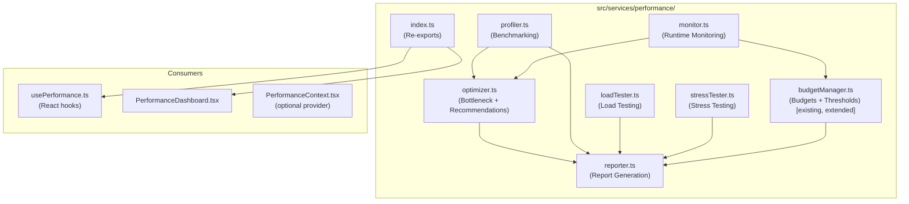

# Design Document: Performance Optimization Framework

## Overview

The Performance Optimization Framework extends the existing `src/services/performance/` directory with a comprehensive suite of services for benchmarking, bottleneck identification, load/stress testing, runtime monitoring, optimization recommendations, budget enforcement, and reporting. It is built as TypeScript service classes following the singleton pattern already established in the codebase (e.g., `performanceMetricsCollector`, `performanceBudgetManager`).

The framework integrates with the existing `PerformanceDashboard` component and `usePerformance` hooks, augmenting rather than replacing the current lightweight monitoring infrastructure.

### Design Goals

- Extend existing services without breaking current consumers
- Keep all services tree-shakeable and independently usable
- Persist monitoring data and budgets via `localStorage` (consistent with existing `persistenceManager` patterns)
- Use `fast-check` (already a dev dependency) for property-based tests
- Use `vitest` (already configured) as the test runner

---

## Architecture



### Data Flow

1. **Profiler** runs benchmarks and stores `BenchmarkResult` records.
2. **Monitor** collects runtime metrics on navigation events and contract calls; compares against budgets via `BudgetManager`.
3. **Optimizer** reads from Profiler and Monitor to identify bottlenecks and generate recommendations.
4. **LoadTester / StressTester** run concurrent operation simulations and produce `LoadTestResult` / `StressTestResult`.
5. **Reporter** aggregates all data into a `PerformanceReport` and serializes/deserializes it as JSON.

---

## Components and Interfaces

### Profiler (`profiler.ts`)

Responsible for executing and storing benchmark runs.

```typescript
interface BenchmarkResult {
  operationName: string;
  timestamp: number;
  durationMs: number;
  memoryKb: number;
}

interface BenchmarkStats {
  operationName: string;
  runs: number;
  meanMs: number;
  medianMs: number;
  minMs: number;
  maxMs: number;
}

class Profiler {
  register(name: string, fn: () => Promise<void> | void): void;
  run(name: string): Promise<BenchmarkResult>;
  getResults(name: string): BenchmarkResult[];
  getStats(name: string): BenchmarkStats | null;
  getAllStats(): BenchmarkStats[];
}
```

### Optimizer (`optimizer.ts`)

Identifies bottlenecks and generates ranked recommendations.

```typescript
type RecommendationCategory = 'caching' | 'batching' | 'lazy-loading' | 'code-splitting' | 'smart-contract';

interface Bottleneck {
  operationName: string;
  meanDurationMs: number;
  percentileRank: number;
  contributingFactors: string[];
  type: 'frontend' | 'smart-contract';
}

interface Recommendation {
  id: string;
  affectedOperation: string;
  measuredValue: number;
  threshold: number;
  remediationStrategy: string;
  category: RecommendationCategory;
  confidenceScore: number; // 0.0 – 1.0
  priority: 'normal' | 'critical';
  consecutiveCycles: number;
}

class Optimizer {
  analyzeBottlenecks(): Bottleneck[];
  generateRecommendations(): Recommendation[];
  recordCycle(): void; // called each monitoring cycle
}
```

### LoadTester (`loadTester.ts`)

Simulates concurrent load against a target operation.

```typescript
interface LoadTestConfig {
  operationName: string;
  operation: () => Promise<void>;
  concurrency: number;
  durationSeconds: number;
}

interface LoadTestResult {
  config: LoadTestConfig;
  throughputOps: number;
  meanLatencyMs: number;
  p95LatencyMs: number;
  p99LatencyMs: number;
  errorRate: number;
  errors: string[];
  passed: boolean;
  timestamp: number;
}

class LoadTester {
  run(config: LoadTestConfig): Promise<LoadTestResult>;
}
```

### StressTester (`stressTester.ts`)

Incrementally increases concurrency to find failure thresholds.

```typescript
interface StressTestConfig {
  operation: () => Promise<void>;
  startConcurrency: number;
  stepIncrement: number;
  stepDurationSeconds: number;
  maxConcurrency: number;
}

interface StressTestStep {
  concurrency: number;
  throughputOps: number;
  meanLatencyMs: number;
  errorRate: number;
}

interface StressTestResult {
  config: StressTestConfig;
  steps: StressTestStep[];
  maxSustainableConcurrency: number;
  failureThreshold: number | null;
  failureDetails: { concurrency: number; errorType: string; timestamp: number } | null;
  timestamp: number;
}

class StressTester {
  run(config: StressTestConfig): Promise<StressTestResult>;
}
```

### Monitor (`monitor.ts`)

Collects runtime metrics continuously; replaces/extends the existing `metricsCollector.ts` for the new requirements.

```typescript
interface RuntimeMetric {
  name: string;
  value: number;
  timestamp: number;
  category: 'page' | 'contract';
}

interface ThresholdViolationEvent {
  metricName: string;
  measuredValue: number;
  thresholdValue: number;
  timestamp: number;
}

class Monitor {
  start(): void;
  stop(): void;
  recordContractCall(name: string, latencyMs: number, success: boolean): void;
  getMetrics(windowStart: number, windowEnd: number): RuntimeMetric[];
  getAggregated(windowStart: number, windowEnd: number): { mean: number; p95: number; p99: number } | null;
  onViolation(handler: (event: ThresholdViolationEvent) => void): () => void;
}
```

### BudgetManager (`budgetManager.ts`) — Extended

The existing `budgetManager.ts` is extended to add persistence and default thresholds per Requirement 7.

```typescript
interface Budget {
  metricName: string;
  threshold: number;
}

// Extended methods added to existing class:
// - defineBudget(budget: Budget): void  (persists to localStorage)
// - getViolations(windowStart: number, windowEnd: number): BudgetViolation[]
// - Default thresholds: pageLoad=3000ms, contractRead=200ms, contractTx=5000ms
```

### Reporter (`reporter.ts`)

Generates and serializes `PerformanceReport` objects.

```typescript
interface PerformanceReport {
  generatedAt: number;
  benchmarkResults: BenchmarkStats[];
  bottlenecks: Bottleneck[];
  loadTestResults: LoadTestResult[];
  budgetViolations: BudgetViolation[];
  recommendations: Recommendation[];
}

class Reporter {
  generate(): PerformanceReport;
  toJSON(report: PerformanceReport): string;
  fromJSON(json: string): PerformanceReport;
}
```

---

## Data Models

### Storage Layout (localStorage)

| Key | Value | Description |
|-----|-------|-------------|
| `perf:budgets` | `Budget[]` JSON | Persisted budget definitions |
| `perf:violations` | `BudgetViolation[]` JSON | Violations (pruned to 24h window) |
| `perf:metrics` | `RuntimeMetric[]` JSON | Runtime metrics (pruned to 24h window) |
| `perf:benchmarks` | `BenchmarkResult[]` JSON | Benchmark results |

### Metric Retention

The Monitor prunes stored metrics older than 24 hours on each write, keeping storage bounded.

### Statistics Computation

For percentile calculations (p95, p99, median), values are sorted ascending and the index is computed as `Math.floor(arr.length * percentile)`. This is consistent with the existing `performanceMonitor.ts` implementation.

### Default Thresholds

| Metric | Default Threshold |
|--------|------------------|
| `pageLoadTime` | 3000 ms |
| `contractRead` | 200 ms |
| `contractTx` | 5000 ms |

---


## Correctness Properties

*A property is a characteristic or behavior that should hold true across all valid executions of a system — essentially, a formal statement about what the system should do. Properties serve as the bridge between human-readable specifications and machine-verifiable correctness guarantees.*

### Property 1: Benchmark result completeness

*For any* registered operation that is executed by the Profiler, the stored `BenchmarkResult` must contain a non-negative `durationMs`, a non-negative `memoryKb`, a positive `timestamp`, and the correct `operationName`.

**Validates: Requirements 1.1, 1.2, 1.3**

---

### Property 2: Benchmark stats invariants

*For any* sequence of benchmark results for the same operation, the computed `BenchmarkStats` must satisfy: `minMs <= medianMs`, `medianMs <= maxMs`, `minMs <= meanMs`, `meanMs <= maxMs`, and `minMs` and `maxMs` must equal the actual minimum and maximum of the input durations.

**Validates: Requirements 1.4**

---

### Property 3: Benchmark retrieval performance

*For any* number of stored benchmark results, calling `getResults()` must complete in under 100ms.

**Validates: Requirements 1.6**

---

### Property 4: Bottleneck identification and ordering

*For any* set of `BenchmarkStats`, the Optimizer's `analyzeBottlenecks()` must return exactly those operations whose `meanMs` exceeds the 90th percentile of all `meanMs` values, and the returned list must be sorted by `meanDurationMs` descending (highest impact first).

**Validates: Requirements 2.1, 2.2, 2.4**

---

### Property 5: Batching detection

*For any* sequence of contract call records where two or more calls share the same operation name within a configurable time window, the Optimizer must include a batching recommendation for that operation.

**Validates: Requirements 2.3**

---

### Property 6: Load test operation invocation count

*For any* `LoadTestConfig` with concurrency `c` and duration `d`, the total number of operation invocations during the test must be at least `c` (at minimum one full wave of concurrent operations was launched).

**Validates: Requirements 3.2**

---

### Property 7: Load test result shape

*For any* completed `LoadTestResult`, the fields `throughputOps`, `meanLatencyMs`, `p95LatencyMs`, `p99LatencyMs`, and `errorRate` must all be present and non-negative, and `p95LatencyMs >= meanLatencyMs` and `p99LatencyMs >= p95LatencyMs`.

**Validates: Requirements 3.3**

---

### Property 8: Load test failure flag

*For any* `LoadTestResult` where `errorRate > 0.01`, the `passed` field must be `false`.

**Validates: Requirements 3.4**

---

### Property 9: Stress test step sequence

*For any* `StressTestResult`, the `concurrency` values in the `steps` array must form an arithmetic sequence starting at `config.startConcurrency` with common difference `config.stepIncrement`, up to the point where the test stopped.

**Validates: Requirements 4.2**

---

### Property 10: Stress test structural invariants

*For any* `StressTestResult` that completed without failure, `maxSustainableConcurrency` must equal `config.maxConcurrency` and `failureThreshold` must be `null`.

**Validates: Requirements 4.4**

---

### Property 11: Stress test failure threshold

*For any* `StressTestResult` where any step has `errorRate > 0.05`, the `failureThreshold` must equal the concurrency of the first such step, and no steps with higher concurrency must appear in the `steps` array.

**Validates: Requirements 4.5**

---

### Property 12: Contract call round-trip

*For any* contract call recorded via `Monitor.recordContractCall(name, latencyMs, success)`, a subsequent call to `Monitor.getMetrics()` covering the recording timestamp must include a metric entry for that call with the correct name and value.

**Validates: Requirements 5.2**

---

### Property 13: Threshold violation emission

*For any* metric value that exceeds its associated budget threshold, the Monitor must emit exactly one `ThresholdViolationEvent` containing the correct `metricName`, `measuredValue`, `thresholdValue`, and a `timestamp` close to the time of recording.

**Validates: Requirements 5.3**

---

### Property 14: Metric retention within 24 hours

*For any* metric recorded at time `t`, calling `getMetrics(t - 1, t + 1)` at any time within 24 hours of `t` must return a result that includes that metric.

**Validates: Requirements 5.4**

---

### Property 15: Aggregation correctness

*For any* set of `RuntimeMetric` values in a time window, the aggregated `mean` must equal the arithmetic mean of the values, `p95` must equal the value at the 95th percentile, and `p99` must equal the value at the 99th percentile.

**Validates: Requirements 5.5**

---

### Property 16: Monitor overhead

*For any* call to `Monitor.recordContractCall()`, the wall-clock time consumed by the call itself must be less than 5ms.

**Validates: Requirements 5.6**

---

### Property 17: Recommendation generation on threshold breach

*For any* operation whose measured value exceeds its budget threshold, `Optimizer.generateRecommendations()` must include a recommendation for that operation containing `affectedOperation`, `measuredValue`, `threshold`, and `remediationStrategy`.

**Validates: Requirements 6.1**

---

### Property 18: Recommendation shape invariant

*For any* `Recommendation` produced by the Optimizer, `category` must be one of `['caching', 'batching', 'lazy-loading', 'code-splitting', 'smart-contract']` and `confidenceScore` must be in the range `[0.0, 1.0]`.

**Validates: Requirements 6.2, 6.4**

---

### Property 19: Recommendation ordering

*For any* call to `Optimizer.generateRecommendations()`, the returned list must be sorted such that recommendations with higher estimated performance impact appear before those with lower impact (no recommendation appears after one with strictly lower impact).

**Validates: Requirements 6.3**

---

### Property 20: Recommendation escalation

*For any* recommendation that has been generated for 3 or more consecutive monitoring cycles without remediation (`consecutiveCycles >= 3`), its `priority` must be `'critical'`.

**Validates: Requirements 6.5**

---

### Property 21: Budget persistence round-trip

*For any* budget defined via `BudgetManager.defineBudget()`, re-instantiating the `BudgetManager` (simulating an app restart by reading from the same localStorage state) must produce a manager that contains the same budget with the same threshold.

**Validates: Requirements 7.2**

---

### Property 22: Violation window filtering

*For any* time window `[start, end]`, `BudgetManager.getViolations(start, end)` must return only violations whose `timestamp` satisfies `start <= timestamp <= end`, and must include all violations within that window.

**Validates: Requirements 7.5**

---

### Property 23: Default thresholds (example)

When no custom budget is defined for `pageLoadTime`, `contractRead`, or `contractTx`, the effective thresholds applied by the Monitor must be 3000ms, 200ms, and 5000ms respectively.

**Validates: Requirements 7.6**

---

### Property 24: Report shape completeness

*For any* call to `Reporter.generate()`, the returned `PerformanceReport` must contain non-null `benchmarkResults`, `bottlenecks`, `loadTestResults`, `budgetViolations`, and `recommendations` fields.

**Validates: Requirements 8.1**

---

### Property 25: Report serialization round-trip

*For any* valid `PerformanceReport` object, `Reporter.fromJSON(Reporter.toJSON(report))` must produce a report that deeply equals the original.

**Validates: Requirements 8.2, 8.3, 8.4**

---

### Property 26: Report generation performance

*For any* volume of stored benchmark results, metrics, and violations, `Reporter.generate()` must complete within 500ms.

**Validates: Requirements 8.5**

---

## Error Handling

### Profiler

- If a registered benchmark operation throws, the Profiler catches the error, records a result with `durationMs = -1` as a sentinel, and re-throws so the caller is aware.
- If `getStats()` is called for an unknown operation name, it returns `null`.

### LoadTester / StressTester

- Individual operation invocation errors are caught, counted toward `errorRate`, and their messages stored in `errors[]`.
- If `concurrency` or `durationSeconds` is zero or negative, the tester throws an `InvalidConfigError` before starting.

### Monitor

- If `localStorage` is unavailable (e.g., private browsing quota exceeded), the Monitor falls back to in-memory storage and logs a warning.
- Metrics older than 24 hours are pruned on each write to prevent unbounded growth.

### BudgetManager

- If `localStorage` deserialization fails (corrupted data), the manager resets to defaults and logs a warning.
- Defining a budget with a non-positive threshold throws an `InvalidBudgetError`.

### Reporter

- If `fromJSON()` receives a string that is not valid JSON or does not match the `PerformanceReport` schema, it throws a `ReportDeserializationError` with a descriptive message.
- `generate()` is designed to be non-blocking; it reads from in-memory caches rather than re-querying storage, ensuring the 500ms budget is met.

---

## Testing Strategy

### Dual Testing Approach

Both unit tests and property-based tests are required. They are complementary:

- **Unit tests** cover specific examples, integration points, and error conditions (e.g., the default threshold example in Property 23, error path behavior).
- **Property-based tests** verify universal invariants across randomly generated inputs (all Properties 1–26 except 23).

### Property-Based Testing

The project already has `fast-check` installed as a dev dependency. All property tests use `fast-check` with `vitest`.

Each property test must:
- Run a minimum of **100 iterations** (configured via `fc.assert(..., { numRuns: 100 })`).
- Include a comment tag in the format: `// Feature: performance-optimization-framework, Property N: <property_text>`

Example structure:

```typescript
import * as fc from 'fast-check';
import { describe, it } from 'vitest';

describe('Profiler', () => {
  it('benchmark result completeness', () => {
    // Feature: performance-optimization-framework, Property 1: Benchmark result completeness
    fc.assert(
      fc.property(fc.string({ minLength: 1 }), async (opName) => {
        // ... test body
      }),
      { numRuns: 100 }
    );
  });
});
```

### Test File Layout

```
src/services/performance/__tests__/
  profiler.test.ts          # Properties 1, 2, 3
  optimizer.test.ts         # Properties 4, 5, 17, 18, 19, 20
  loadTester.test.ts        # Properties 6, 7, 8
  stressTester.test.ts      # Properties 9, 10, 11
  monitor.test.ts           # Properties 12, 13, 14, 15, 16
  budgetManager.test.ts     # Properties 21, 22, 23
  reporter.test.ts          # Properties 24, 25, 26
```

### Unit Test Focus Areas

- Error paths: invalid config, corrupted localStorage, unknown operation names
- Integration: Monitor → BudgetManager violation pipeline
- Default threshold values (Property 23 — example test)
- Edge cases: empty datasets, single-element datasets, zero-duration operations

### Property Test Generators

Key `fast-check` arbitraries needed:

| Arbitrary | Used for |
|-----------|----------|
| `fc.array(fc.float({ min: 0, max: 10000 }), { minLength: 1 })` | Duration arrays for stats invariants |
| `fc.record({ operationName: fc.string(), durationMs: fc.nat(), memoryKb: fc.nat(), timestamp: fc.nat() })` | BenchmarkResult |
| `fc.record({ metricName: fc.string(), value: fc.float({ min: 0 }), timestamp: fc.nat(), category: fc.constantFrom('page', 'contract') })` | RuntimeMetric |
| `fc.record({ generatedAt: fc.nat(), benchmarkResults: fc.array(...), ... })` | PerformanceReport (for round-trip) |
